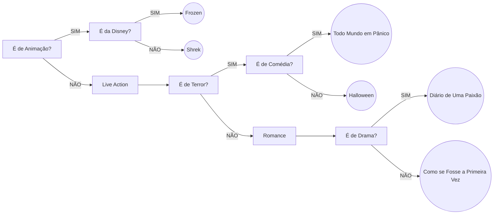

# Exercícios

Aqui estão os exercícios dado em cada dia de aula, separados por dia.

## Links

- [Exercícios da aula 1](./aula1)
- [Exercícios da aula 2](./aula2)
- [Exercícios da aula 3](./aula3)
- [Exercícios da aula 4](./aula4)
- [Exercícios da aula 5](./aula5)

## Diagrama da aula 2 em Mermaid

