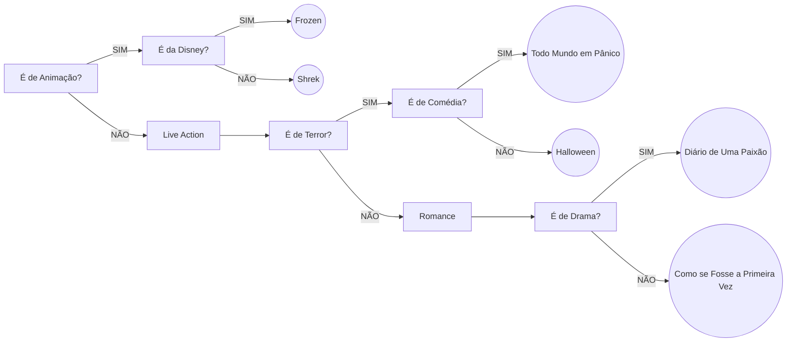

# Diagrama da Aula 2

```mermaid
flowchart LR

A[É de Animação?]

A -- SIM --> B[É da Disney?]

B -- SIM --> F((Frozen))
B -- NÃO --> S((Shrek))

A -- NÃO --> C[Live Action]
C --> D[É de Terror?]

D -- SIM --> E[É de Comédia?]
E -- SIM --> TMP((Todo Mundo em Pânico))
E -- NÃO --> H((Halloween))

D -- NÃO --> R[Romance]
R --> DR[É de Drama?]
DR -- SIM --> DP((Diário de Uma Paixão))
DR -- NÃO --> PV((Como se Fosse a Primeira Vez))
```
